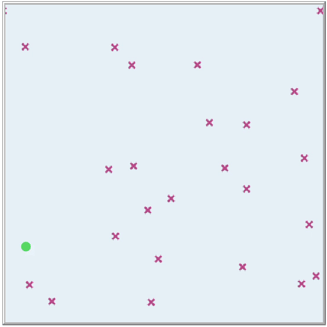
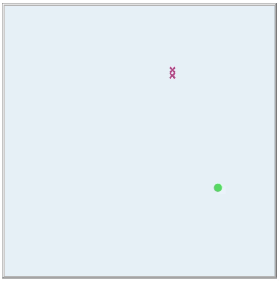
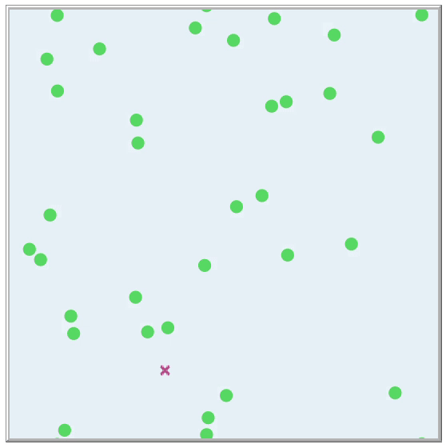

# 🧫 Crecimiento y competencia de bacterias usando Modelación Basada en Agentes

Este repositorio contiene el proyecto final desarrollado por **Frida Michelle Vargas Bautista** como parte del curso *Proyecto I* de la Facultad de Ciencias de la UNAM, impartido por el **Biol. Luis Guillermo García Jácome**.

El trabajo integra una simulación construida desde cero en **NetLogo**, complementada con un documento escrito que desarrolla la motivación biológica, la justificación del modelo, su estructura técnica y un análisis de los resultados. Además, el proyecto está inspirado en un ejercicio propuesto dentro de un texto de investigación en biología computacional.

---

## 🔎 Descripción general

  

El modelo simula la **interacción entre dos tipos de bacterias** en un entorno cerrado: una cepa común (**E. coli**) en morado y una **cepa acidófila** (tipo *Lactobacillus*) en verde. Las bacterias compiten por espacio y recursos en un medio lácteo, donde la cepa acidófila modifica el entorno al producir ácido al consumir lactosa, lo que puede intoxicar a las bacterias sensibles si el pH baja demasiado.

El sistema está gobernado por reglas locales que definen reproducción, consumo de recursos, acidificación del entorno, y dispersión de acidez. Se modelan tiempos generacionales dependientes del pH mediante funciones spline cúbicas, lo que permite observar dinámicas no lineales.

> *"Si nuestro cuerpo funciona es porque nuestras células se comunican."*  
> Esta idea me acompaña todavía, y cobra vida en estos modelos donde agentes simples, al interactuar, dan lugar a algo mucho más grande y complejo.

---
<table>
  <tr>
    <td align="center"></td>
    <td align="center"></td>
    <td align="center"></td>
    <td align="center"></td>
  </tr>
</table>

## 💡 Características del modelo

- Espacio toroidal (mundo sin bordes).
- Dos tipos de bacterias:
  - **Bacteria acidófila** (color morado): consume más lactosa y acidifica su entorno.
  - **Bacteria sensible (E. coli)** (color gris): sufre toxicidad si el pH disminuye demasiado.
- Consumo diferencial de lactosa y producción de ácido.
- Reproducción local si hay espacio disponible y suficiente energía.
- Muerte por acidez modelada como función probabilística.
- Dispersión de acidez entre parches vecinos.
- Tiempo generacional dependiente del pH, definido mediante funciones spline cúbicas.

---

## 📘 Inspiración bibliográfica

Este trabajo fue inspirado por un ejercicio sugerido en el siguiente texto:

**MacKinnon, R. J., Cline, E. R., Hillen, T., & Louis, P. Y.** (2019).  
_An Introduction to Undergraduate Research in Computational and Mathematical Biology._ Springer.

> 📚 Capítulo 5: *Simulating Bacterial Growth, Competition, and Resistance with Agent-Based Models and Laboratory Experiments* (pp. 217–243)

---

## 🎓 Contexto académico

- **Curso:** Proyecto I  
- **Profesor:** Biol. Luis Guillermo García Jácome  
- **Facultad:** Ciencias, UNAM  
- **Semestre:** 2025-I

---
## 📂 Archivos incluidos

- `modelo_final.nlogo` — Modelo completo implementado en NetLogo.
- `Trabajo_Frida_Vargas.pdf` — Documento escrito con introducción, modelo, análisis y resultados.
- `Trabajo_Frida_Vargas_con_anotaciones.pdf` — Versión del trabajo con anotaciones realizadas durante la retroalimentación académica.

> Se incluye la versión anotada como parte del proceso formativo, conservando la evidencia de revisión y mejora del trabajo.

**Este proyecto fue realizado de forma completamente individual como entrega final del curso. La simulación y el trabajo escrito reflejan el proceso de exploración, integración interdisciplinaria y aplicación de herramientas computacionales al modelado biológico. Fue evaluado y mejorado con base en observaciones académicas, lo que fortaleció aún más su desarrollo.**

